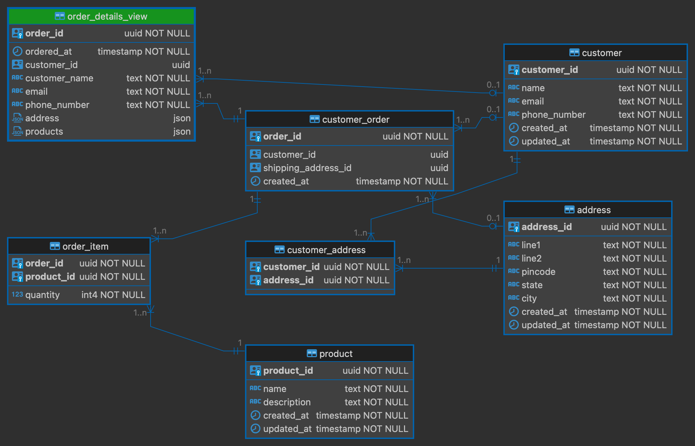

## ER Diagram

## Some more details
ddl.sql contains the script to setup the above schema,

dml.sql contains sql scripts to fetch order details and there is a with clause to insert the records into order_details_view table